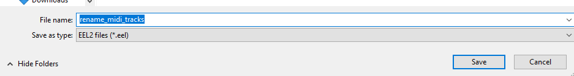

# Importing MIDI into Ocarina of Time with help from Reaper

There are various MIDI editors and MIDI capable DAWs (Digital audio workstations). This guide presumes that you want to use Reaper as your DAW of choice. Reaper is professional music production software but has a tolerable nag-ware trial (similar to Sublime Text) and *only* a $60 personal license if you get super into this music production thing.

This guide is written for a Windows user, but Reaper works on Mac and Linux.

This might be overwhelming on only a small laptop screen. If you have the option, go to a desk.

## Background 
MIDI is both the name of the protocol that electronic instruments speak and the file format of songs produced with these electronic instruments in mind. A MIDI file (.mid) is like sheet music for a computer. However, you do not need to be able to read or play sheet music to work with MIDI files. More specifically, a MIDI file is a sequence of commands telling a program how to play back a song.

The General MIDI 1 (GM1) standard defines a set of virtual instruments that should generally be supported for MIDI files you'll find on the internet and try to play in Windows Media Player or whatever are designed with this instrument set in mind.

Ocarina of Time does not use MIDI, but it uses a sequenced format that we can convert to. OoT doesn't use GM1 instruments. Instead it has its own set of instruments that has some custom effects not in GM1, but it also doesn't have every instrument in GM1. Notably it doesn't have a drum kit.

OoT has bunches of instruments, bunch each song only uses a fixed set of instruments. The set of instruments used in a specific song is referred to as the audio bank. For now lets assume we need to use an existing audio bank... IDK how to do anything else yet.

## Downloads

* Reaper https://www.reaper.fm/download.php - The subject of this guide.

* TX16Wx https://www.tx16wx.com/download/ - A free DAW plugin to play back virtual instruments. This is literally the first one I came across. Others might be better. IDK.

* DezZival's OoT Sound Font https://www.youtube.com/watch?v=qpPzR-FodYc - Link in the description. This is a set of virtual instruments based on those used in OoT and MM.

* seq64 1.5 https://github.com/sauraen/seq64/releases/tag/V1.5 - The tool to convert MIDIs into OoT's seq format and inject them into a ROM. V2.0 and is different and existing guides assume 1.x versions of the software.

* ROM Decompressor https://github.com/OoTRandomizer/OoT-Randomizer/raw/Dev/bin/Decompress/Decompress.exe - seq64 needs an uncompressed rom. The utility used by OoT Rando works.

* Sekaiju https://openmidiproject.opal.ne.jp/Sekaiju_en.html - A GM 1 compatible MIDI editor. People seem to recommend it for setting loop points. IDK if Reaper can export loop points yet.

* Anvil Studio 64-bit for Windows https://www.anvilstudio.com/ - An alternative basic MIDI editor. People seem to hate on it but out of the box it is easier to use than Sekaiju. I'm only using it to playback GM 1 MIDIs.


## Setup

> You will need an OoT ROM. ***DO NOT*** ask me or OoT Rando related discords for a rom. You just can't do that. 

For this guide I'm creating a folder on my desktop called `OoT Music Demo`.  I made a `Downloads` folder in there and placed everything above in there.

### Install Downloads

These are the files I have. You may have newer versions downloaded.
* `asinstall.exe`
* `Decompress.exe`
* `Ocarina of Time Soundfont 2.0.1.zip`
* `reaper711_x64-install.exe`
* `Sekaiju8.0.zip`
* `seq64_v1.5.zip`
* `TX16Wx Software Sampler 3.6.0h x64.msi`

Double click `reaper711_x64-install.exe` and follow the wizard. If Reaper opens after the install finishes, **close it** for now.

Double click `TX16Wx Software Sampler 3.6.0h x64.msi` and follow the wizard.

(Optional) Double click `asinstall.exe` (anvil studio) and follow the wizard. 

(Optional) Double click `Sekaiju8.0.zip`. Drag `Sekaiju8.0` into `OoT Music Demo` to extract it.


Right click `seq64_v1.5.zip`. Select *`Extract All...`*. Press the **`Extract`** button without changing the path. Now drag the `seq64_v1.5` folder into `OoT Music Demo` to move it.


Drag `Decompress.exe` into `OoT Music Demo` to move it.

Double click `Ocarina of Time Soundfont 2.0.1.zip`. Drag the `Soundfonts` folder into `OoT Music Demo` to extract it. Go back to `OoT Music Demo`. Do a slow double click or right click → *`Rename`* `Soundfonts` and change its name to `OoT_Soundfonts_2.0.1`.

### Decompress ROM

> *Don't make me tap the sign!*

In `OoT Music Demo` I made the folder `rom`. I made a copy of my rom and placed it in this folder.

Press <kbd>win</kbd>+<kbd>r</kbd> to open the Windows Run dialogue. Type `cmd` and press enter. A black terminal window should appear. *DON'T PANIC*. Drag `Decompress.exe` onto this window. Type a space (` `) into the window. Drag your rom onto the window. Press the <kbd>enter</kbd> key. This should create a `-decomp` (decompressed not decompiled) rom next to your original rom.


We will need this decompressed rom later.

### Getting a MIDI
For this demo I will be using `town.mid` that comes with Windows. Paste `C:\Windows\Media` into the Windows Explorer address bar and press enter.


Find `town.mid` and copy it into `OoT Music Demo`. Rename the copy to `town_original.mid`.

Double clicking it should open it in Windows Media Player for playback. You could also open it in Sekaiju or Anvil Studio and hit play in there.

## Importing a MIDI into Reaper

### Open Reaper
The first time you launch it, it may take a small bit. If you have not closed Reaper since installing TX16Wx, close Reaper and then open it again.

### Make a new project
Make sure you're starting with a new project. *`File → New project`*


**Immediately** save the new empty project. <kbd>ctrl</kbd>+<kbd>s</kbd>. I'm saving my project to `OoT Music Demo` and calling it `town_oot_port`. **CHECK** the *`Create subdirectory for project`* box! Also **CHECK** the *`Copy all media into project directory`* box!


Continue to save regularly.

### Import the MIDI
Drag `town_original.mid` onto the start of the timeline.


Leave the *`Expand 11 MIDI tracks to new REAPER tracks`* and *`Import MIDI tempo map to project tempo map at 1.1.00`* boxes checked. Press the **`OK`** button.


Your timeline Reaper window should now look like this:


<kbd>ctrl</kbd>+<kbd>s</kbd>.

### Reopening your project
After saving you can close Reaper. Launching Reaper again will open the last used project. You can also double click the `OoT Music Demo\town_oot_port\town_oot_port.rpp` project file from Windows Explorer or find it in the *`File → Open project...`* menu inside Reaper.

### Reaper Basics
https://www.reaper.fm/guides/REAPER%20Quick%20Start.pdf

* Scrolling while hovering over the timeline zooms in time.
* Scrolling while hovering over the track list does "normal" scrolling. Pans the view up and down if there are more than what fits on your screen.
* Holding <kbd>Ctrl</kbd>+<kbd>Alt</kbd> while scrolling over the timeline will also do normal vertical scrolling.
* Holding <kbd>Alt</kbd> while scrolling will pan horizontally. (Touchpad horizontal scrolling also works.)
* Holding <kbd>Ctrl</kbd> while scrolling will adjust how much vertical space tracks take up.

### Assigning playback instruments
The MIDI we imported was made with GM 1 instruments. But Reaper is a tool for modern musicians and doesn't really care about the legacy instrument information from our file. So if we hit play right after importing the track, we'll hear nothing. Reaper wants us to tell it how it should perform each track. Which, that is like one of the reasons we're using a DAW like Reaper.

But first there's just a bit more of setup.

#### Renaming tracks
`town.mid` is a nice MIDI where all the tracks are labeled with the expected instruments and the tracks use all the playback channels in order. But not all MIDIs are this nice. So after a small amount of googling I found this script to rename the tracks and we're going to run it.

Open the Action window: *`Actions → Show action list...`*


Click the **`New action...`** button then select *`New ReaScript...`*.


This opens a file save window. 
* Use the default save location.
* Set the *`Save as type`* to `EEL2 files (*.eel)`.
* Use the filename `rename_midi_tracks`
* Hit the **`Save`** button.



That will open this funny window:


We're going to copy this script and paste it into this window. 
* Open https://gist.githubusercontent.com/linkviii/3d12c04c5b05c3bdd8927292bce6c9ba/raw/592e7539d1f2cfb18b663f33a92ade73da2cc7f2/rename_midi_tracks.eel 
* Hit <kbd>Ctrl</kbd>+<kbd>a</kbd> to select all the text
* Hit <kbd>Ctrl</kbd>+<kbd>c</kbd> to copy it.
* Select the funny black Reaper window.
* Hit <kbd>Ctrl</kbd>+<kbd>v</kbd> to paste the script.
* Hit <kbd>Ctrl</kbd>+<kbd>s</kbd> to save the script.
* Now close the funny window.

Now that we have the script we're going to run it.
* Select everything on the timeline
  - Click anywhere in the timeline.
  - Hit <kbd>Ctrl</kbd>+<kbd>a</kbd>
* Run the rename tracks script
  - If you closed the Actions window, open it again
  - Type into the *`Filter`* box `rename midi`.
  - Double click the script


Your tracks should now look like this:


#### Put tracks in a folder
One last bit of house keeping before we actually get to play with instruments. We're grouping all our tracks together in a folder.
* Click on any track in the left panel
* Hit <kbd>Ctrl</kbd>+<kbd>a</kbd>
* Right click any track
* Select *`Move tracks to folder`* → *`New folder track`* 


After moving to a folder, it should look like this.


<kbd>Ctrl</kbd>+<kbd>s</kbd>

#### Assigning OoT instruments with TX16Wx
Click the **`FX`** button on the folder track.


This opens the FX plugin browser. Type `wx` into the *`Filter`* and double click `VST3i: TX16Wx (CWITEC)`


This opens a giant window for the TX16Wx plugin. Arrange your windows so that you can see the track list in Reaper.

Use the file browser in  the plugin to find the `OoT_Soundfonts_2.0.1` folder. Once you find it you should press the star **`★`** button to bookmark it.

You should be like here:


**Finally, now the fun part!**

Each `.sf2` file is a set of instruments as they are used in OoT. 

Lets double click `16 Shop Theme.sf2`. Oh. It only has 7 instruments and `town.mid` uses more than that. Oh well. Lets try to make it work. It has some of what we need. AND it has percussion. That is not a given for oot.

Double click `Nylon Guitar`. This will assign the instrument to Ch01. Finally now if we hit play in Reaper we will hear anything at all. We got a groovy guitar line. And that matches the intent of our original "1 - Acoustic Guitar" track. We can also double click one of the other instruments and see how they would sound instead.

For the bigger picture on how an instrument sounds, press the *`Regions`** button. This will expand a view of a piano keyboard and will show what ranges of the keyboard use what samples for the virtual instrument. You can press the keys to see how any note will sound.


Alright. Next track. Right click empty space below and select *`New slot`*.


When you run out of empty space to click on for new tracks, you can instead right click somewhere of an existing slot and select *`New program slot`*.


Click on the new slot to focus it. Notice how it says `Ch02`. This is going to be the instrument for our "2 - Electric Guitar" track. Well nothing fits... Lets just select Nylon Guitar again and move on for now.


Rinse and repeat...

Track 10: Drums. We have `Conga / Shaker`. But if we expand **`Regions`**, we'll see that this is nothing like a standard MIDI drum kit. Well maybe it will work out. Otherwise we'll have to do some arranging work later.

All together:


Hit play in Reaper. Ya know, this sounds pretty good.

<kbd>Ctrl</kbd>+<kbd>s</kbd>

#### Saving our instruments to the MIDI
We had our fun. Now back to the tedious part. Open a notepad and write down every instrument we selected TX16Wx.

```
Guitar
Guitar
Bass
Accordion
Accordion
Trumpet
Trombone
Trumpet
Bass
Conga/shaker
Accordion
```

We can now close TX16Wx window. Instruments will still play even with it closed.

Now open https://www.chisako.eu/deathbasketslair_backup/OoT_Instr_List.html . This page lists the instrument ID numbers for each instrument set. We used the Shop instrument set so we'll look for that on this page. In our text file we're going to write down the matching instrument number.

```
Guitar		0
Guitar		0
Bass		2
Accordion	1
Accordion	1
Trumpet		4
Trombone	3
Trumpet		4
Bass		2
Conga/shaker OxA
Accordion	1
```

Now we put these numbers into our MIDI.

1. On the Reaper timeline, double click on the "1 - Acoustic Guitar" track. 
   * This will open the detailed MIDI editor.
2. Click on the Event List tab. 
   * A table should now be shown.
3. Find the row with the *`Type`* value of `PC`.
   * PC stans for Program Change. This is MIDI speak for switching instruments.
4. Edit the value for that row and set it to the one written down in the text file
   * Check off that line in the text file to help keep track of what you've done
5. Select the next track.
   * There is a drop down in the bottom right.
   * You can also close this window and double click from the timeline on another track.

Rinse and repeat.


Track 10: Our reference site listed "Drum" as having the hexadecimal value 0xA. We need to convert this to decimal to enter it into Reaper. In this case the decimal value for 0xA is 10.

```
Guitar		0	Done
Guitar		0	Done
Bass		2	Done
Accordion	1	Done
Accordion	1	Done
Trumpet		4	Done
Trombone	3	Done
Trumpet		4	Done
Bass		2	Done
Conga/shaker 10	Done
Accordion	1	Done
```

<kbd>Ctrl</kbd>+<kbd>s</kbd>

### Export the MIDI

### Load into seq64

#### Oh no warnings to fix.